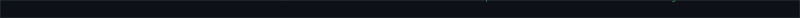
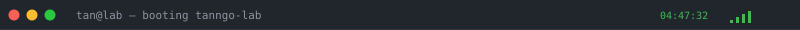
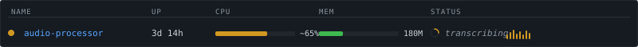
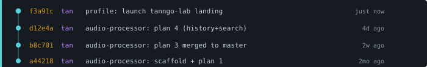
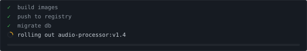

<!-- Boot sweep -->


<!-- Matrix rain strip -->


<!-- Title bar -->


<!-- Boot panel: ASCII logo + neofetch -->
<table>
  <tr>
    <td valign="top"></td>
    <td valign="top"></td>
  </tr>
</table>

<!-- Animated typing line -->
<a href="https://github.com/tanngo-lab">
  
</a>

> a personal lab for self-hosted tools I actually use.
> nothing here lives on someone else's machine.

---

## $ services --watch



## $ tree services/


## $ git log --graph



## $ man tan

```
TAN(1)                 tanngo-lab manual                 TAN(1)

NAME
    tan — engineer, self-hoster, builds tools for the household

SYNOPSIS
    tan [--ship] [--dogfood] [--no-cloud]

DESCRIPTION
    small, opinionated services. ts/node + docker. owns the whole
    stack — from the metal to the UI. ships things he uses every
    week.

SEE ALSO
    audio-processor(1)
```

## $ tail -f journal.log


## $ deploy.sh — last run



## $ contact --help

| flag | description | value |
|------|-------------|-------|
| `--email` | reach me directly | tan.ngo@playstudios.asia |
| `--github` | code lives here | [github.com/tanngo-lab](https://github.com/tanngo-lab) |
| `--audio-processor` | flagship project | [github.com/tanngo-lab/audio-processor](https://github.com/tanngo-lab/audio-processor) |

<!-- Status bar -->

